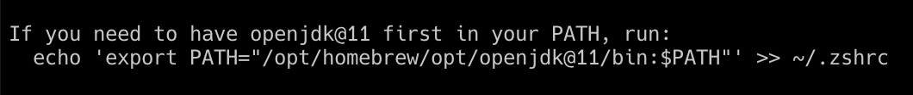
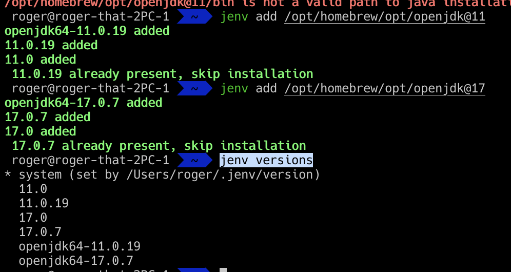
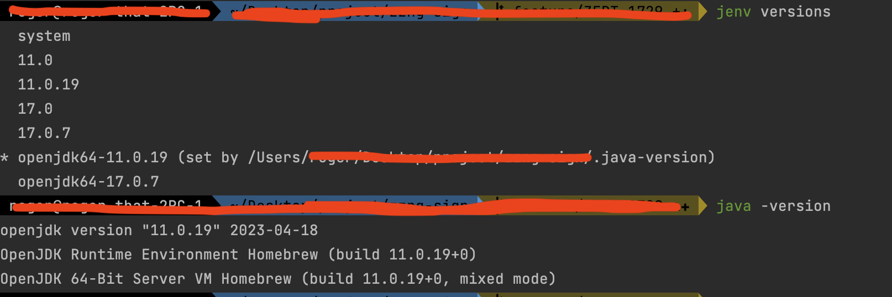

## jenv?
* 여러 java version을 사용할때 jenv를 사용하면 간단하게 버전을 변경해가며 사용할수 있다.

## jenv 설치
* `brew install jenv`

## jenv 설정
```
echo 'export PATH="$HOME/.jenv/bin:$PATH"' >> ~/.zshrc
echo 'eval "$(jenv init -)"' >> ~/.zshrc
source ~/.zshrc
```

## java 설치
* `brew install openjdk@11`
* `brew install openjdk@17`

## java 설치 경로 확인
* `brew info openjdk@17`


## jenv 추가
* `jenv add /opt/homebrew/opt/openjdk@11`
* `jenv add /opt/homebrew/opt/openjdk@17`


## jenv 등록된 java list
* `jenv versions`


## jenv 버전 변경 
* `jenv local openjdk64-11.0.19`
* 버전 변경 후 `jenv versions`의 `*` 기호가 변경된 버전으로 이동한 것과 `java -version`으로 적용이 잘 됬는지 확인 할 수 있다.

