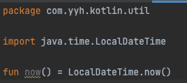
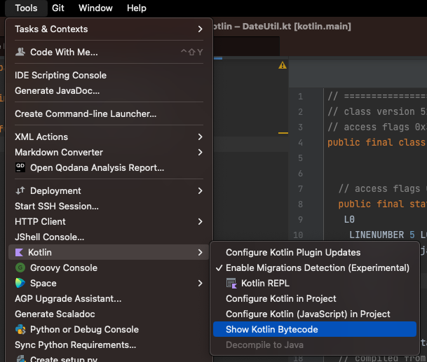
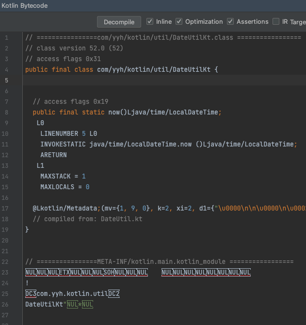
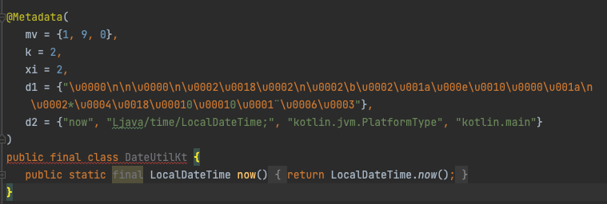
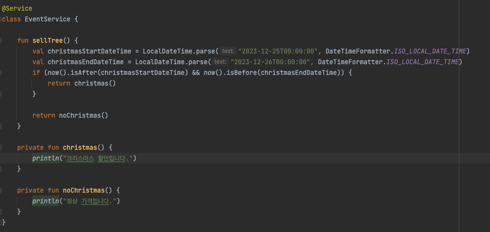
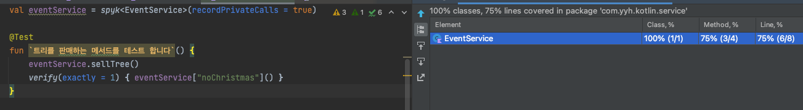
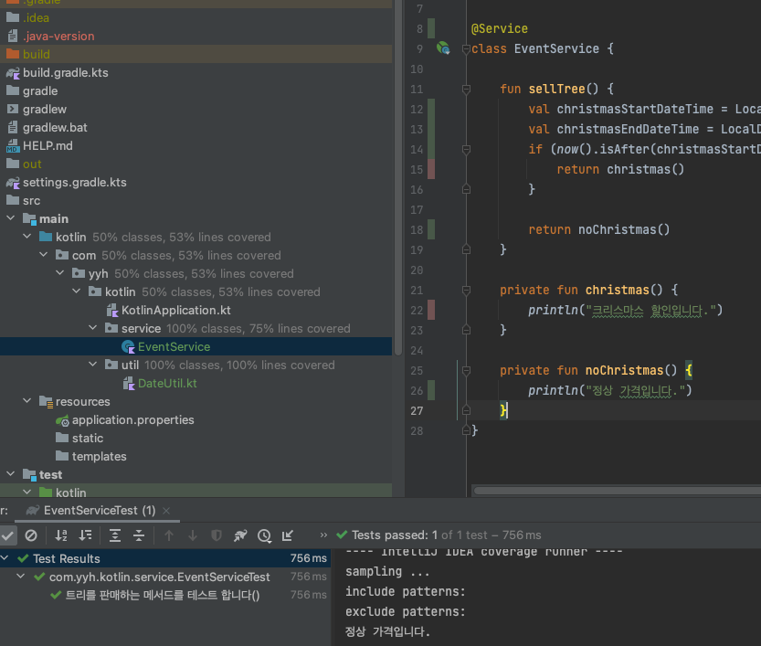
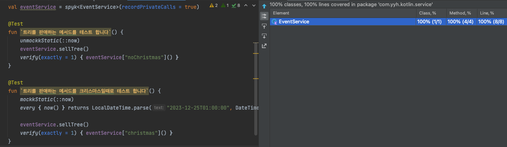
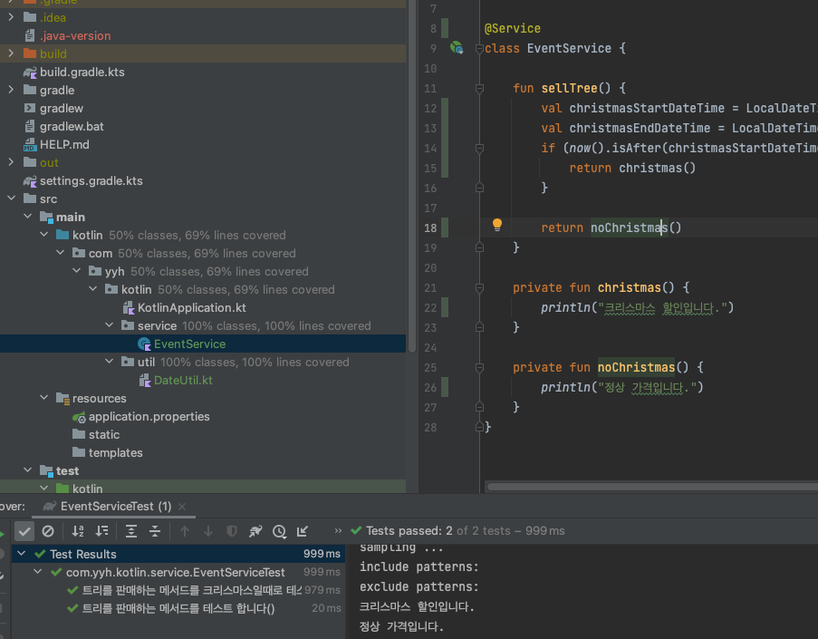

## kotlin에서 package level mocking을 통해 테스트 커버리지 100% 달성하기
으례 프로젝트를 신규로 시작할 때 테스트 코드의 커버리지 100%를 목표로하게 되는데 테스트 코드 100%를 달성하는 것은 다양한 이유로 힘이 듭니다.
* 테스트 코드를 먼저 작성하지 않고 개발 후 작성하여 놓치거나 😡 시간이 부족할 때 🕰️
* 테스트 하기 좋지 않은 코드일 때 🤪

이중 테스트 좋지 않은 코드가 만들어 지는 이유는 주로 두가지가 있습니다.🧐
* 제어가 되지 않는 코드 (전역 함수, 전역 변수, 외부 SDK에 의존, Random, Date 등)
* 외부의 영향을 받는 코드 (외부 API, Logger, 데이터 베이스 등)

위와 같은 경우 순수한 Junit으로 테스트가 불가능하게 되고 `Mocking 또는 테스트를 가능하도록 코드를 수정`하여 테스트 코드를 작성하게 됩니다. 

외부의 영향을 받는 코드는 Mocking을 통해 테스트를 가능하게 하고 테스트의 구동 시간을 줄일수 있습니다.

제어가 되지 않는 코드의 경우는 Mocking이 쉽지 않는데 😟 이를 해결 하는 방법 하나를 소개 하려고 합니다.

## Mockk의 Package level mock 기능
보통 Kotlin에서 테스트 프레임워크로 mockk과 mockito를 두종류의 테스트 프레임워크를 많이 사용하게 됩니다.

두개중 개인적으로 mockito보다 mockk을 더 선호하는데 그 이유중 하나인 `mockk의 기능중 package level mock 기능`을 소개 하려고합니다. 🤩

[참고로 mokito는 소개하려는 package level mocking 지원하지 않습니다](https://github.com/mockito/mockito/issues/1468)

## package level function 이란?
Package-level function은 Top-level function이라고도 불리는 kotlin의 기능으로 java나 scala처럼 top level의 함수를 두기 위해 별도의 클래스를 두지 않고 파일의 최상위 수준, 패키지 레벨에 함수를 두는 기능입니다.

이런 기능을 통해 코틀린에서는 전역 변수, 전역 함수, Random, Date에 관련된 유틸을 작성하여 많이 사용하게 됩니다. 
`이런 부분을 Mocking하여 테스트 코드를 작성 한다면` 테스트 커버리지를 높일수 있습니다.

좀더 이해 하기 위해 잠깐 🖐️ 살펴보면 kotlin의 Package-level function은 java의 정적 메소드로 변환되는데 intellij에서 변환되는 과정을 간단히 확인해 볼수 있습니다.

Tool -> Kotlin -> Show Kotlin Bytecode로 Kotlin에서 Bytecode로 변환된 결과를 볼수 있습니다.  

Bytecode 변환된 코드를 Decomplie 버튼을 통해 자바로 변환 시킬수 있습니다.

결과적으로 Java 로 변환된 것을 보면 Package-level function이 final class에 정적 메서드로 지정된 메서드를 볼수있습니다

## package level function mocking 하기!

### 테스트 하기 힘든 코드
이제 위에서 말한 Package-level function을 사용하는 크리스마스 이벤트로 크리스마스 기간동안 할인을 하는 코드를 작성해 봅니다. 

Package-level function의 now()는 현재 시간을 알려주고 이 시간이 크리스마스라면 christma() function을 호출하고 이외의 시간이라면 noChrismas function을 호출합니다.

처음 말했던 테스트 하기 힘든 전형적인 코드에서 `제어가 되지 않는 코드`의 예라고 할수 있습니다. 🤮 🤮 🤮

### 테스트 커버리지를 100% 달성 하지 못한 테스트 코드
mockk의 spyk를 통해 실제 생성된 클래스의 Object를 mocking해서 호출 합니다. 
chrismas가 아니기 때문에 `정상 가격입니다.`가 출력 되며 verify를 통해 1회 호출 됬음을 확인할 수 있습니다.

하지만 `제어가 되지 않는 코드` 때문에 크리스마스 기간에 대한 테스트를 작성하지 못했고 code의 coverage는 100%를 달성하지 못했습니다. 😢 

클래스의 라인 커버리지를 보면 크리스마스 기간에 타는 분기에 대한 테스트를 커버 하지 못했음을 볼 수 있습니다.

### 제어가 되지 않는 코드를 mocking하기 
mockk에서는 `mockkStatic`를 통해서 package-level function을 mocking 할수 있습니다.

`mockkStatic(::now)`로 현재 시간을 나타내는 now()를 크리스마스의 시간 대로 mocking 하였고
실행을 하면 `크리스마스 할인입니다.`를 출력하며 mocking이 잘 됬음을 확인 할수 있습니다. 

결과적으로 테스트 코드의 coverage를 100%로 달성 할수 있습니다. 😁 😁

클래스의 라인 커버리지를 확인하면 크리스마스 기간에 대한 분기 또한 커버를 하였음을 볼수 있습니다.

### 👊 마무리 👊
개발자라면 배포에 대한 부담을 줄이기 위해 개발과 수정을 빠르게 하게 테스트 코드 커버리지를 높이고자 많이 생각합니다.

특히 새로운 프로젝트를 생성 하였을때 그런 욕심이 많이 생기게 되지만 시간이 지날 수록 커버리지가 낮아 지게 됩니다.

이런 이유는 테스트 코드를 작성하기 힘들게 코드를 작성 하는 개발자 잘못과 타성에 젖어 테스트 코드 작성을 안하는 경우도 있습니다.

하지만 또 다른 이유로 외부의 요인과 제어하기 힘든 코드에서 나오는 값이 동일한 값으로 보장 되지 않아 테스트 코드가 작성 하기 어려운 환경이 되기도 합니다.

`소개드린 방법은 작은 부분에 대한 예제이지만 테스트 코드를 작성 하기 힘든 이유를 좀더 명확히 하고 이런 부분 또한 테스트 커버리지를 높일 수 있는 방법을 소개 드리고자 하였습니다. 저를 포함한 개발자들이 배포에 대한 부담을 조금 덜었으면 합니다!!`

### 참고링크
* <https://mockk.io/#top-level-functions>
