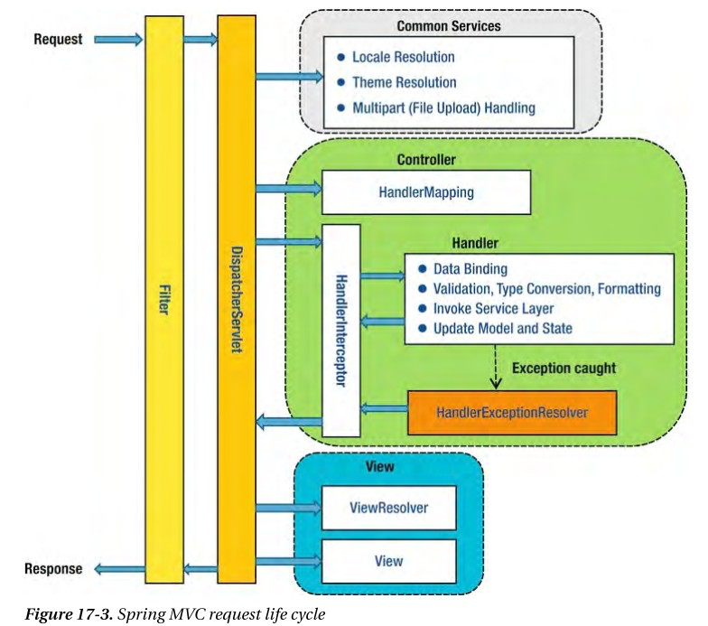

## Filter, Interceptor, AOP 차이
### 접근 순서
Filter -> Interceptor -> AOP -> Interceptor -> Filter의 순서로 접근하게 된다

* pojo(plain old java object)방식 프레임 워크
* j2ee에 비해 특정 인터페이스를 구현 상속 받을 필요 없음
* 영속성과 관련된 다양한 서비스 ibatis등을 제공
