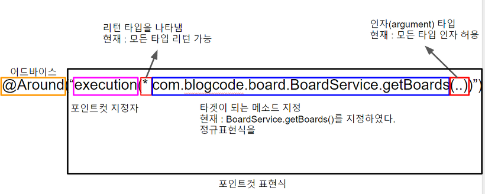

```java
@Aspect
public class Performance {

    @Around("execution(* com.blogcode.board.BoardService.getBoards(..))")
    public Object calculatePerformanceTime(ProceedingJoinPoint proceedingJoinPoint) {
        Object result = null;
        try {
            long start = System.currentTimeMillis();
            result = proceedingJoinPoint.proceed();
            long end = System.currentTimeMillis();

            System.out.println("수행 시간 : "+ (end - start));
        } catch (Throwable throwable) {
            System.out.println("exception! ");
        }
        return result;
    }
}
```


* OOP만으로 모듈화 하기 힘든 부가 기능을 효과적으로 분리, 모듈화 하도록 도와주는 기술
* 트랜젝션 분리(경계설정)을 프록시와 데코레이터 패턴으로 이해
* 리플렉션으로 구현되는 프록시패턴으로 작동합니다.
* 트랜잭션 속성을 지정하는 방법은 포인트컷, 메소드 이름 @Transactional 애노테이션 방법이 있다
* @Transactional을 이용해 DB 테스트 코드를 쉽게 만들수 있다
* 따라서 트랜잭션이나 로깅, 보안과 같이 여러 모듈에서 공통적으로 사용하는 기능의 경우 해당 기능을 분리하여 관리할 수 있다.

인터프리터 설명추가?

## 참고링크
* spring aop 정리 <https://jojoldu.tistory.com/69>
