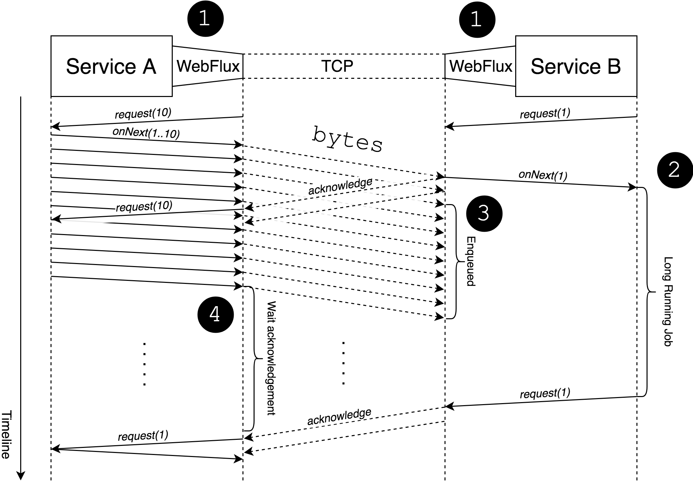

## Spring webmvc + webclient를 적용하면서든 의문점들
새로운 프로젝트를 생성하게 되면서 http client를 어떤거로 선택할지를 결정하면서 든 고민들과 의문, 느낀점 적어보았습니다.

### HTTP client를 무었으로 쓸까에 대한 고민?
Spring에서 다른 서버로 API를 호출할때 httpclient는 보통 기본적으로 지원되는 RestTemplate를 사용하게 되거나 interface에 몇가지 어노테이션과 선언으로 client를 jpa처럼 사용하는 Feign을 많이 사용하는것을 많이 보았습니다.

하지만 RestTemplate가 deprecated된다는 소식에 RestTemplate를 신규 프로젝트에 사용하는건 많이 줄은것 같습니다.

참고로 RestTemplate는 deprecated가 된다는 것은 [토비의 유투브](https://www.youtube.com/watch?v=S4W3cJOuLrU&t=649s) 에서 자세하게 설명해주신데로 루머입니다.

또한 RestTemplate을 사용할때 반복되는 코딩 작업은 번거롭기 때문에 선호하지 않아 제외 하였습니다

그래서 Feign을 고려하였지만 spring starter로 간단하게 제공 된다는 점과 비교적 간편한 사용 그리고 Spring6 Springboot3 에서 지원하게된 declarative HTTP 선언은 매력적으로 보여 Feign의 대체로 매력적으로 보여 Webclient를 사용하는 것이 좋겠다고 생각이 들었습니다.

Webflux + WebClient 또는 Webmvc + Feign이 주로 보았던 구성이였습니다.

그런데 찾아보니 Webmvc + WebClient에 대한 글도 많이 찾을수 있어 
Spring Webmvc + WebClient가 어떤것을 말하는 것인지 어떻게 구성되는 것인지 어떤 방식인지 의문이 들었습니다.

## Spring webmvc와 Webclient를 구성하려면?
```java
implementation("org.springframework.boot:spring-boot-starter-web")
implementation("org.springframework.boot:spring-boot-starter-webflux")
```
Spring boot starter web에는 spring webmvc가 포함되어 있고 
Webclient는 Spring boot starter webflux에 포함되어 있습니다.

그렇다면 위처럼 두개의 의존성을 사용하면 될것처럼 보입니다. 
그런데 의문입니다 Webmvc와 Webflux가 동시에 들어가면 어떻게 되는걸까요?

## Webmvc와 Webflux가 동시에 들어가면?
```java
@SuppressWarnings({ "unchecked", "rawtypes" })
public SpringApplication(ResourceLoader resourceLoader, Class<?>... primarySources) {
    this.resourceLoader = resourceLoader;
    Assert.notNull(primarySources, "PrimarySources must not be null");
    this.primarySources = new LinkedHashSet<>(Arrays.asList(primarySources));
    this.webApplicationType = WebApplicationType.deduceFromClasspath();
    this.bootstrapRegistryInitializers = new ArrayList<>(
            getSpringFactoriesInstances(BootstrapRegistryInitializer.class));
    setInitializers((Collection) getSpringFactoriesInstances(ApplicationContextInitializer.class));
    setListeners((Collection) getSpringFactoriesInstances(ApplicationListener.class));
    this.mainApplicationClass = deduceMainApplicationClass();
}

static WebApplicationType deduceFromClasspath() {
    if (ClassUtils.isPresent(WEBFLUX_INDICATOR_CLASS, null) && !ClassUtils.isPresent(WEBMVC_INDICATOR_CLASS, null)
            && !ClassUtils.isPresent(JERSEY_INDICATOR_CLASS, null)) {
        return WebApplicationType.REACTIVE;
    }
    for (String className : SERVLET_INDICATOR_CLASSES) {
        if (!ClassUtils.isPresent(className, null)) {
        return WebApplicationType.NONE;
        }
    }
    return WebApplicationType.SERVLET;
}
```
Springboot의 어플리케이션 메인 클래스에서 호출하게 되는 메서드를 따라가게되면 
어플리케이션 타입을 지정하는것을 볼수 있고 
이때 webflux와 webmvc가 둘다 있게 되면 Servlet 모드로 동작을 하게 됩니다.

```java
@AutoConfiguration(after = { ReactiveWebServerFactoryAutoConfiguration.class, CodecsAutoConfiguration.class,
		ReactiveMultipartAutoConfiguration.class, ValidationAutoConfiguration.class,
		WebSessionIdResolverAutoConfiguration.class })
@ConditionalOnWebApplication(type = ConditionalOnWebApplication.Type.REACTIVE)
@ConditionalOnClass(WebFluxConfigurer.class)
@ConditionalOnMissingBean({ WebFluxConfigurationSupport.class })
@AutoConfigureOrder(Ordered.HIGHEST_PRECEDENCE + 10)
@ImportRuntimeHints(WebResourcesRuntimeHints.class)
public class WebFluxAutoConfiguration {
    ...
}
```
어플리케이션 타입이 지정되게 되면 자동 설정을 하는데
webmvc는 WebMvcAutoConfiguration webflux는 WebFluxAutoConfiguration를 통해서 진행됩니다.

WebFluxAutoConfiguration는 3개의 Conditional이 유효할때 활성화 되게 됩니다. 
1. 어플리케이션 타입이 REACTIVE일때
2. WebFluxConfigurer가 클래스 패스에 존재할때
3. WebFluxConfigurationSupport Bean이 없을때

### 그렇다면 Spring Webmvc + Webclient 조합의 정체는? 
결과적으로 Spring webmvc + webclient를 하기 위해 webmvc와 webflux를 동시에 사용하게되면 
Spring Webflux의 자동구성은 하지 않고 Webmvc로 동작하는것을 알수 있습니다.

## Mono, Flux를 Controller로 리턴하게 되면 어떻게 동작하는가
위까지 찾아보고 Webflux까지 사용할 필요가 없다고 생각되었습니다. 

이유는 APM에서 트랙킹이 잘되지 않고 오류 추적이 힘들고 
기존에 동기적인 로직들을 비동기적으로 변경하기에 공감대와 리소스가 많이 들것이라고 생각했습니다.

그래서 Webclient로 호출한 API의 리턴값인 Mono와 Flux를 Controller에 return 하는 간단한 예제를 끄적이고 있었습니다.

Webflux를 사용하여 결과를 꺼내줄때 RestController에 Publisher의 구현체인 Mono 또는 Flux를 꺼내 주게 됩니다.

그런데 저는 Webmvc를 사용하며 Mono와 Flux를 꺼내주는데 정상 동작합니다. 의문이 들었습니다.

curl 또는 웹브라우저로 Uri를 호출할때 그렇다면 Subscribe는 누가 언제 어떻게 해주는 걸까요?

```java
public void service(ServletRequest request, ServletResponse response) throws ServletException, IOException {
        ...
    AtomicBoolean completionFlag = new AtomicBoolean();
    ServletHttpHandlerAdapter.HandlerResultSubscriber subscriber = new ServletHttpHandlerAdapter.HandlerResultSubscriber(asyncContext, completionFlag, logPrefix);
    asyncContext.addListener(new ServletHttpHandlerAdapter.HttpHandlerAsyncListener(requestListener, responseListener, subscriber, completionFlag, logPrefix));
    this.httpHandler.handle(httpRequest, (ServerHttpResponse)httpResponse).subscribe(subscriber);
}
```
ServletHttpHandlerAdapter의 service라는 메서드의 끝은 아래와 같습니다.

결과적으로 Webflux로의 반응형 요청은 내부적으로 subscribe되어 Http의 읽기 쓰기로 변환되어 내보내 지게 되는것으로 보입니다.

### 그렇다면 반응형의 이점인 Backpress 처리는 어떻게 하는가?
의문이 또 들었습니다. 반응형의 이점인 Backpress 처리는 어떻게 해주는걸까?

webflux의 backpress 처리를 찾아보니 위처럼 TCP 레벨의 처리를 보여주고 있습니다.

정확한지는 모르겠지만 http 프로토콜에 지원하지 않기 때문에 OS단계의 TCP의 흐름 처리가 되고 있으나 
더 상위 단계에서 로직적인 Backpress는 처리하지 않는 것으로 보입니다.

[스택오버플로우](https://stackoverflow.com/questions/52244808/backpressure-mechanism-in-spring-web-flux)

### 결론
여러가지를 찾아보며 신규 프로젝트는 Spring Webmvc + Webclient로 결정하였습니다.

계속 찾아보며 여러 블로그에서 말하는 Webmvc + Webclient이 어떻게 동작 하는지 궁금했고 몇몇 질문들은 해소 되었습니다.

하지만 Webmvc에서 Webclient를 쓰며 publish 구현체를 최종으로 꺼내주면 subscribe가 동작하는게 어떤의미 인지 성능에 어떤 결과를 주는지 아직 궁금합니다.

또 Webflux를 사용하면 Webmvc보다 어떤점이 더 좋아질지 테스트도 진행해보고 싶은 생각이 들었습니다.