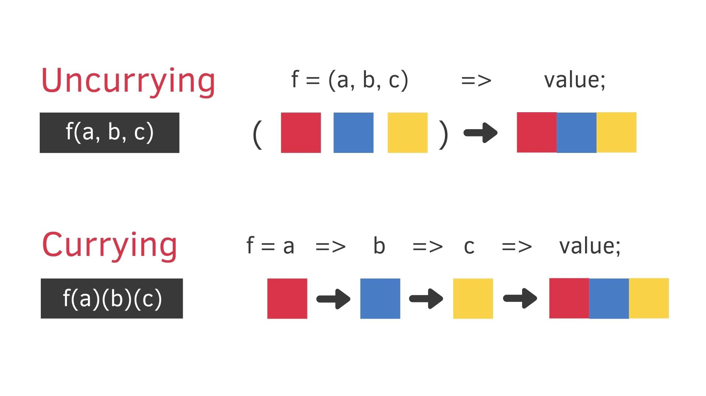

### 커링과 언커링이란?

* 커링은 Haskell Brooks Curry에서 이름을 따온 수학적 기법입니다
* 커링(currying): 다중인수의 함수를 단일인수의 함수들로 바꾸는 것 f(a,b,c) -> h(a)(b)(c) 
* 언커링(uncurrying): 단일인수의 함수들을 다중인수의 함수로 되돌리는 것 h(a)(b)(c) -> f(a)(b)(c)

### 커링의 장점?
1. const squares = [1, 2, 3].map(x => power(2, x)); 
2. const squares = [1, 2, 3].map(powerCurried(2));
* 1번의 경우 익명 함수로 인자를 하나 받아서 다중인수의 함수를 호출하지만
* 2번의 경우 단일 함수로 바뀌었다.
* 변환 과정은 아래와 같다.
1. x => power(2, x)
2. powerCurried = A => B => power(A, B)
3. powerCurried(2) = 2 => B => power(2, B)

```scala
def curry[A,B,C](f: (A, B) => C): A => (B => C) =
  a: A => b: B => f(a: A, b: B)

def uncurry[A,B,C](f: A => B => C): (A, B) => C =
  (a, b) => f(a)(b)

// 언커링 커링 sum
val sum: (Int, Int) => Int = (x, y) => x + y
val curriedSum: Int => Int => Int = x => y => x + y

// 스칼라에서는 여러인수를 허용 하기 때문에 아래처럼도 할수 있다.
def sum(x: Int, y: Int): Int = x + y
def curriedSum(x: Int)(y: Int): Int = x + y

// 사용할때 이점
val numbers: List[Int] = List(1, 2, 3)
numbers.map(n => sum(1, n)) shouldBe List(2, 3, 4)
numbers.map(curriedSum(1)) shouldBe List(2, 3, 4)
```


### 참고
* <https://medium.com/hannah-lin/fp-currying-3de006469b14>
* <https://www.baeldung.com/scala/currying>