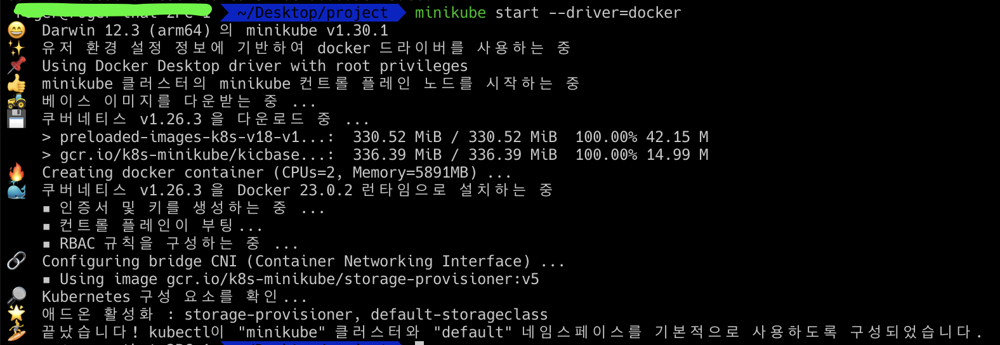
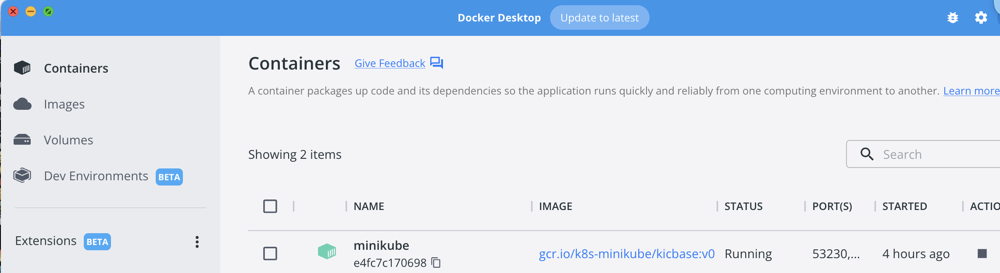

## brew를 통해 minikube 설치
brew install minikube

## minikube 실행 with driver 선택
* minikube start --driver=docker : 단독 클러스터 구성
* minikube start --driver=docker --nodes 3 : 워커노드 2개와 함께 구성
* minikube add node : 워커 노드 추가

## minikube 클러스터 삭제
* minikube stop: 중지 후 삭제해야한다.
* minikube delete: 클러스터 컨테이너 삭제
* minikube delete --all: 클러스터 프로필 삭제

## minikube dashboard 활성화
* minikube dashboard : 웹브라우저 바로 실행
* minikube dashboard --url : url 표시
  
  

## k8s 확인
* minikube를 설치했다면 minikube context가 이미 세팅이 되어있다.
* kubectl config use-context minikube : minikube로 context 지정
* kubectl get namespace : 기본 세팅된 네임스페이스 확인
