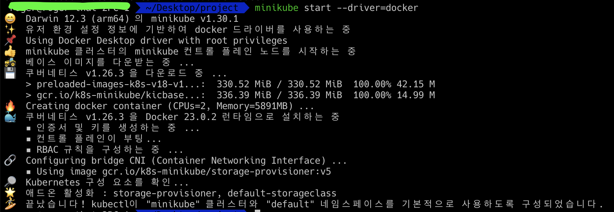

## brew를 통해 minikube 설치
brew install minikube

## minikube 실행 with driver 선택
minikube start --driver=docker

## minikube dashboard 활성화
* minikube dashboard : 웹브라우저 바로 실행
* minikube dashboard --url : url 표시
  
  

## kubectl 설치
brew install kubectl

