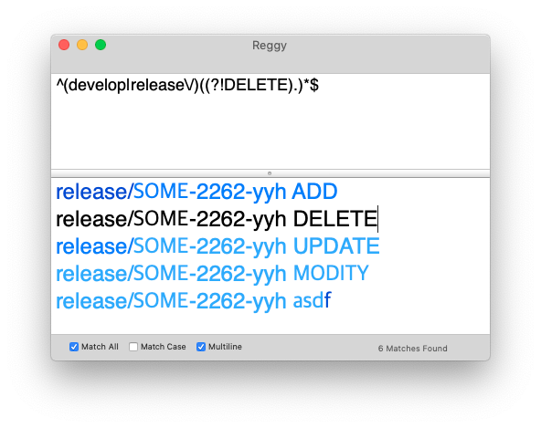

임시

## lookaround
* positive lookahead: (?=표현식) 표현식이 오른쪽에 매치될 때
* negative lookahead: (?!표현식) 표현식이 오른쪽에 매치되지 않을 때
* positive lookbehind: (?<=표현식) 표현식이 왼쪽에 매치될 때
* negative lookbehind: (?<!표현식) 표현식이 왼쪽에 매치되지 않을 때

## 포함되지 않는 문자열 정규식
^((?!my string).)*$

### english dictionary
1. grep -P "(.).*\1" ./aa.txt
- 끝글자 시작글자 동일
2. grep "[a|o|u|i|e]\+" ./aa.txt
- 모음 포함
3. grep "[a]" ./aa.txt | grep -v "[q]"
- a포함 q제외
4. grep -P "(.)\1\1" ./aa.txt
- 3글자 동일
5. grep -v "[v]" ./aa.txt | grep -P "[^aioue]{6,}"
- v제외한 자음 6글자 연속

### doner splice sites part one
1. grep -P "(?<=[^C]{5})GT" ./bb.txt
- 앞 부분 C가 없는것
2. grep -P "(\w{5})GT\1"
- 앞과 뒤가 같은것
3. grep -vP "(?<=GT){5}GT(?<=GT){5}" ./bb.txt
- 앞뒤에 GT가 없는것

### doner splice sites part two
1. sed 's/[C]/G/g' ./cc.txt
- 모든 C -> G
2. sed 's/C/G/' ./bb.txt
- 처음 C -> G
3. sed 's/(.)GT(.)/\2GT\1/g' ./cc.txt
- 앞 뒤 교환

### 참고링크
* https://www.regular-expressions.info/lookaround.html
* https://elvanov.com/2388 정규표현식 Lookahead, Lookbehind 기능 이해하기
* https://community.appway.com/screen/kb/article/checking-strings-avoiding-catastrophic-backtracking-1482810891360 치명적 역추적
* https://blog.naver.com/dsyun96/222715934643 [Kotlin] 정규식 look-behind에서 반복 제한 이슈
* https://lktgt.tistory.com/33 정규표현식의 엔진과 성능
* https://regex101.com/
* https://devopedia.org/regex-engines
* https://learn.microsoft.com/ko-kr/dotnet/standard/base-types/backtracking-in-regular-expressions
