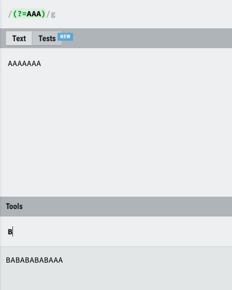
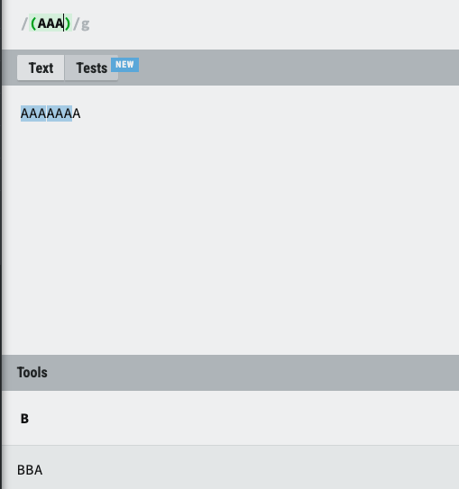
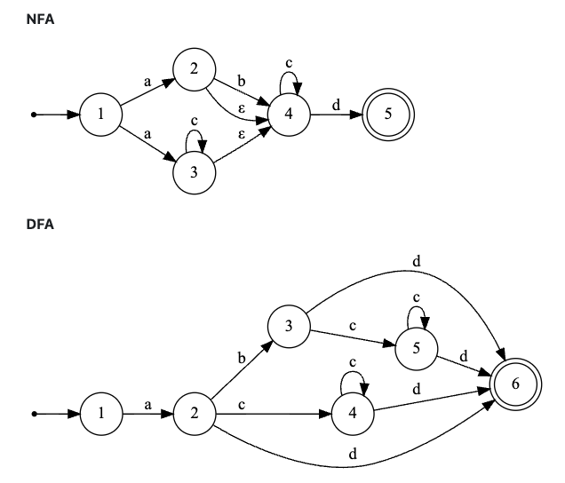
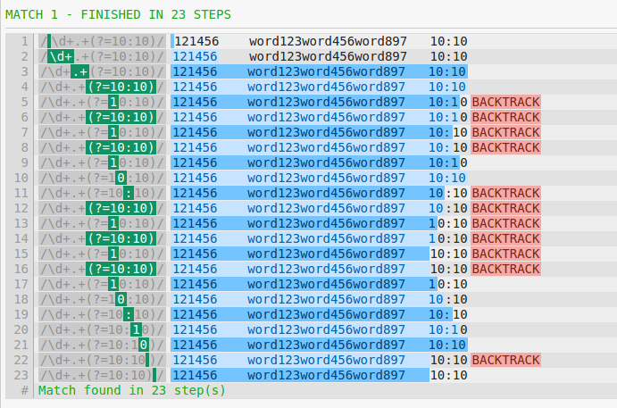

## 정규표현식의 lookbehind를 써도 되는가?!
개발하는 서비스의 마스킹 처리를 위해 lookbehind를 쓰게 되었는데 많이 사용하지 않는 방식이라 이런 구문에 이슈는 없을지 문득 궁금하여 찾아보았습니다.
🧐

### lookbehind란?

정규표현식에서 lookaround는 특정 패턴의 앞이나 뒤를 보고 패턴을 찾는 방법입니다.

이 방법은 lookaround, lookbehind 두가지의 집합이고 Zero-Length Assertions에 해당합니다.

`이중 lookbehind를 다양한 랭귀지에서 기본으로 제공하지 않고 있는데 언젠가 성능상에 어떠한 이슈가 있다는 이야기를 들어 보았지만 정확한 이유를 몰라 찾기 시작했습니다.
`

이번글은 그런 이유가 있을지에 대해서 알아보고 lookbehind가 Java에서 어떻게 동작하는지와 유의할 점을 알아 보고자 합니다.

### Zero-Length Assertions 이란?
일단 위에서 말한 Zero-Length Assertion 이란 의미에 대해서 알아 보겠습니다.🙈🙉

Assertion은 참/거짓 만 판단한다는 의미이고 뜻하고 Zero-Length 또는 Zero-width는 capture 그룹에 포함하지 않고 match된 값을 포기한다는 의미입니다.

결국 lookaround가 Zero-Length Assertion 이란 말은 `앞과 뒤에 일치 여부 결과만을 판단하여 가져오고 결과(match)값을 포기하는 방식`입니다.

### Capture group과의 차이!
capture group과 비슷한 lookaround Zero-Lenth는 뭐고 Assertion은 무었이며 capture group과 무슨차이가 있는 걸까요?

위에서 말한 차이와 또하나의 차이는 결과가 소모되지 않는다는 차이가 있습니다. 예시로 이해해 보겠습니다.
* `(?=aaa)` 표현식은 `positive lookahead 방식`으로 표현식의 오른쪽에 동일한 표현식이 일치 하는지를 찾게 됩니다. 
* AAA가 오른쪽에 일치할때 마다 B를 입력하게 된다면 `원문에서 AAA가 오른쪽에 있을때 마다` B를 찍게되어 BABABABABAA 라고 변환되게 됩니다.
  
* `(aaa)` 표현식은 Capture group으로 AAA가 일치하게되면 결과를 capture 하게 되고 `원문에서 AAA는 소모`하게 됩니다. 때문에 2개의 match된 값은 B로 변경 되게 됩니다.
  

lookaround는 이렇게 capture group과 다르게 결과를 찾을때 결과를 소모하지 않고 match 결과를 가져오지도 않는 차이가 있다는 것을 알아보았습니다.

### lookaround의 종류
본격적으로 lookaround를 알아봅시다. 정규표현식에서 lookarond의 종류는 아래처럼 4가지가 있습니다..
* positive lookahead: (?=표현식) 표현식이 오른쪽에 매치될 때
* negative lookahead: (?!표현식) 표현식이 오른쪽에 매치되지 않을 때
* positive lookbehind: (?<=표현식) 표현식이 왼쪽에 매치될 때
* negative lookbehind: (?<!표현식) 표현식이 왼쪽에 매치되지 않을 때

간단한 예시로 보면 아래와 같습니다.
* `asdf(?=ghjk)` 는 asdfghjk 에서 asdf 뒤에 ghjk가 있을 때 매치됩니다.
* `asdf(?!ghjk)` 는 asdfghjk 에서 asdf 뒤에 ghjk가 있을 때 매치됩니다.
* `(?<=asdf)ghjk` 는 asdfghjk 에서 asdf 뒤에 ghjk가 있을 때 매치됩니다.
* `(?<!=asdf)ghjk` 는 asdfghjk 에서 asdf 뒤에 ghjk가 있을 때 매치됩니다.

### 그렇다면 이 좋아 보이는 lookaround중 lookbehind는 왜 잘 안쓸까?
그렇다면 문맥에 따라 위의 4가지의 경우에 해당하는 lookaround의 방식을 사용하면 되지 않을까?

왜 lookahead는 많이 사용하는데 lookbehind는 잘 사용하지 않고 언어에서 제공하지 않는 경우도 있을까?

`The bad news is that most regex flavors do not allow you to use just any regex inside a lookbehind, because they cannot apply a regular expression backwards. The regular expression engine needs to be able to figure out how many characters to step back before checking the lookbehind.`

`When evaluating the lookbehind, the regex engine determines the length of the regex inside the lookbehind, steps back that many characters in the subject string, and then applies the regex inside the lookbehind from left to right just as it would with a normal regex.`

정규표현식 튜토리얼 사이트에서 말하길 정규식은 거꾸로 평가할수 없기 때문에 정규식엔진들은 lookbehind를 지원하지 않는다고 합니다.

lookbehind를 지원할때는 뒤로 돌아갈 길이를 정하고 뒤로 돌아가 lookbehind의 정규식을 평가하는 방식을 사용하는 방식을 사용합니다.

그리고 정규표현식 튜토리얼 사이트에서 java의 lookbehind 구현 방식을 설명해 놓은것은 아래와 같습니다.

`Java continues to step back until the lookbehind either matches or it has stepped back the maximum number of characters`

`자바에서는 lookbehind가 일지 할때 까지 한칸식 계속 물러난다는 의미로 반복적으로 평가`한다는 의미입니다. 🤩 

뒤로 돌아가서 평가 하는 방식을 사용하는데 lookbehind가 포함된 표현식이 `(?<!ab{2,4}c{3,5}d)test` 와 같다면 평가 할때 7~11글자까지 가능하므로 최소글자 7글자를 되돌아 가서 평가하고 한글자씩 뒤로 가며 반복적으로 평가하게됩니다.

(?<=a{1,3})ghjk 를 찾는다고 하면 끝의 ghjk를 먼저 찾고 앞을 평가 하는것이 아니라 현재 위치에서 한글자 뒤로 물러나서 평가하고 일치 할때 까지 찾는 방식을 사용하고 있습니다.

이러한 이유로 java8 까지는 `+` `*` 과 같은 무한 수량자를 사용할 경우 PatternSyntaxException가 발생하였고 java9 부터는 허용이 됩니다.

`Java 13 allows you to use the star and plus inside lookbehind, as well as curly braces without an upper limit. But Java 13 still uses the laborious method of matching lookbehind introduced with Java 6. Java 13 also does not correctly handle lookbehind with multiple quantifiers if one of them is unbounded. In some situations you may get an error.`

정규표현식 튜토리얼 사이트에서는 java13까지는 무한 수량자를 쓰지 말고 {0, 20} 과 같은 낮은 수량 제한자를 사용하라고 하고 있습니다.

결국 자바에서 lookbehind는 무한 수량자를 사용하거나 {0, 2000}과 같은 너무 큰 수량자를 사용하게 되면 성능이 이슈가 있을수 있습니다.

### 정규표현식 해석
이런 해석 문제가 생기는 이유는 자바 그리고 많은 언어들이 정규식을 해석하는 방식이 NFA 방식을 채택하기 때문입니다. 😳

정규식을 해석하는 방식은 NFA(비결정 유한 오토마타), DFA(결정 유한 오토마타)가 있는데 (ab?|ac*)c*d를 두가지로 해석하면 다음과 같습니다.

위에 이미지를 보아도 어질어질 이해가 안가지만 😭 결국 DFA는 어떤 input에 대한 상태가 하나이기 때문에 복잡한 정규 표현식을 나타내기 힘듭고 NFA는 input에 따라 상태가 변경되어 길이 변경되게 됩니다.

결국 DFA는 더 엄격하고 그래프 구조에 제한이 있기 때문에 정규표현식은 NFA의 변형(Backtracking, Bitparallel, Thompson, Tabled)중 Backtracking NFA를 많이 사용하고 있습니다.

참고로 Backtracking NFA의 장점은 capture group을 지원하고 lookaround, Backreferences를 지원등이 있습니다.

### Backtracking NFA를 사용하는 정규 표현식 Lookbehind를 쓰면 어떻게 될까? 
이런 Backtracking NFA로 정규 표현식을 해석하는 순서의 예시는 아래처럼 볼수 있습니다.

`\d+.+(?=10:10)`를 평가할때는 3단계로 구분해서 볼수 있습니다.
1. \d+모든 숫자와 일치
2. .+ 탐욕스럽기 때문에 모든 문자열을 일치시키고 마지막으로 이동합니다.
   1. 정규식은 가장 왼쪽의 최대 길이를 일치 시킵니다. 😱
3. 위를 완료하면 (?=10.10)문자열이 남지 않습니다. 따라서 모든 조건이 충족되지 않으므로 이 조건을 충족하기 위해 정규식 엔진은 다음을 찾을 때까지 역추적을 시작합니다.

### 흠 그럼 결론은? 🧐
찾고자 했던 내용은 사실 개발하는 서비스의 마스킹 처리를 위해 lookbehind를 써도 되는지 쓰면 안되는지를 찾고자 하였습니다.

과거에 lookbehind에 퍼포먼스 이슈가 있다는 내용을 본적이 있었고 좀더 명확히 알고자 정규표현식 해석 과정과 lookbehind 처리 방식을 찾아보며 정리 해보았습니다.

결과적으로 `lookbehind는 백트랙킹을 위해 돌아가야할 길이를 수량자를 쓰게 된다면 알수 없기 때문에 최소 수량자에서 최대 수량자 만큼 뒤로 돌아가며 반복적으로 백트래킹하여 평가하기 때문에 퍼포먼스에 이슈가 있을것`이라는 추측 하게 되었습니다.

아쉽게도 명확한 답은 찾을수 없었지만 정규표현식 해석 과정과 java에서 lookbehind를 처리하는 과정을 알아보며 작은 수량자 또는 고정된 lookbehind의 정규표현식은 사용해도 괜찮을것 같다! 라는 결론을 내려보았습니다.
🤪

