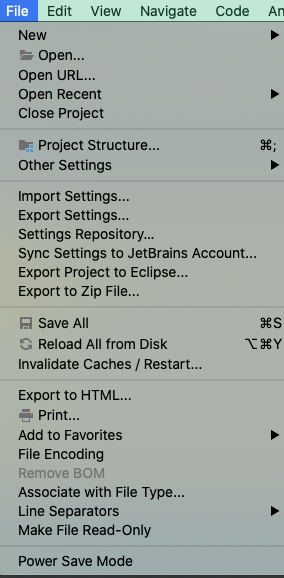
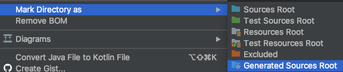

## Q파일 인식이 안되고 generated source root로 등록이 안되있을때 해결 방법

* File -> Invalidate Caches/Restart 캐시 무효화하고 다시 시작

* 생성된 Q파일 폴더 오른쪽 클릭

* generated source root 선택

### 참고링크
* https://stackoverflow.com/questions/26952078/intellij-cannot-resolve-symbol-on-import
