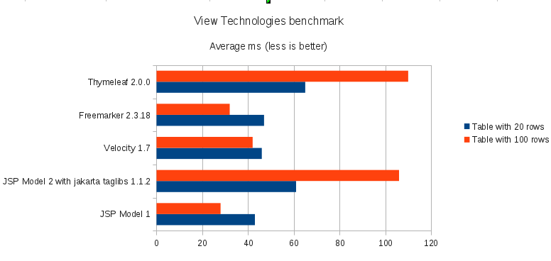

```java
compile("org.springframework.boot:spring-boot-starter-freemarker")
compile("org.springframework.boot:spring-boot-starter-thymeleaf")
compile group: 'org.apache.velocity', name: 'velocity', version: '1.6.2'
```


* thymeleaf
  ** 기본으로 많이 사용
  ** freemarker와 velocity보다는 성능이 느림

* velocity
  ** 가벼운것이 장점
  ** freemarker 보다 기능이 떨어짐

* freemarker
  ** velocity 만큼 가벼움
  ** velocity 보다 파워풀

### 참고링크
* Freemarker(프리마커) 안전하게 사용하기 <https://jojoldu.tistory.com/30>
